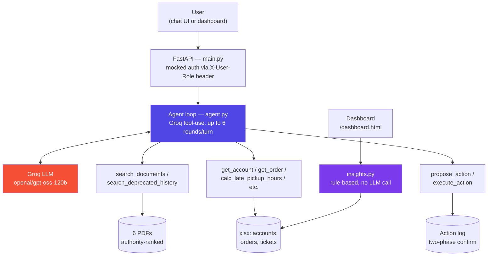

<div align="center">

# ParcelPilot AI Ops Assistant

**A tool-using LLM agent for logistics support & operations**
*Built for the CalQuity AI Engineer assessment*

[](https://www.python.org/)
[](https://fastapi.tiangolo.com/)
[](https://groq.com/)
[](https://github.com/MuhammadAbbas01/parcelpilot-ai-support/actions/workflows/ci.yml)
[](LICENSE)

### [Live Demo](https://extraversive-intendedly-nathalie.ngrok-free.dev) · [Test Prompts](docs/test_prompts.md) · [Architecture Notes](docs/architecture_note.md)

</div>

<br>

> **Summary:** Contracts override policy, policy overrides product
> docs, and deprecated documents are excluded automatically. This is
> enforced in code rather than left as a prompt instruction the model
> might not follow consistently.

<br>

## The problem, in three lines

- ParcelPilot's support team answers questions using **4 kinds of sources that disagree**: signed contracts, general policy, product docs, live tickets.
- A naive chatbot picks whichever source it finds first — and gives a **confidently wrong answer**.
- For a support tool, a wrong-but-confident answer is worse than no tool at all.

## What I built

- An agent that reasons across **contracts → policy → product docs → live data**, in that priority order — enforced by code, not prompting.
- **Access control inside the tools**, not the prompt — a jailbreak attempt still can't reach data it shouldn't.
- **Actions require a real confirmation token** the model can't fake — not just an instruction to "ask first."
- A **rule-based dashboard** (no LLM cost) that surfaces SLA risk and cross-customer issue patterns before anyone has to go looking.

<br>

## See it work

<details>
<summary><b>Click to expand the full, unedited exchange</b></summary>

<br>

**Q: Can Northstar cancel ORD-1001 without a cancellation fee? Explain why.**

🔧 `get_order(order_id: "ORD-1001")`
🔧 `get_account(account_id: "ACCT-001")`
🔧 `search_documents(account_id: "ACCT-001", query: "cancellation fee")`

**Yes — Northstar can cancel ORD-1001 with no cancellation fee.**

| Source | Authority | What it says |
|---|---|---|
| Northstar Enterprise Agreement | Contract (highest) | *"Northstar may cancel any BOOKED shipment before pickup with NO cancellation fee, regardless of how long ago it was booked."* |
| Cancellation & Service-Credit SOP v4 | Policy (lower) | Free within 30 min; ₹250 after — unless a signed agreement waives it. |

The contract is specific to this account and, per the authority
hierarchy, overrides the general SOP. ORD-1001 is BOOKED and not yet
picked up, matching the contract's waiver condition — so the fee does
not apply.

</details>

Seven more scenarios like this — including one built to test whether
the agent can be misled by an outdated policy document — are in
[`docs/test_prompts.md`](docs/test_prompts.md). They can be tried
directly against the live demo.

During testing, this same verification process caught a real bug: the
Groq API rejected the model passing `null` for an optional parameter,
which caused a 500 error on a specific query type. It was reproduced,
fixed by widening the parameter's schema type, and re-verified against
the running server (commit `88f6061`).

<br>

## Decisions that matter, and the trade-off accepted for each

| Decision | Why | Trade-off |
|---|---|---|
| Authority ranked **in code**, not the prompt | A prompt can drift; a filtered list can't | More tagging work per document |
| Access control **inside the tools** | Prompt-only checks are jailbreak-able | More boilerplate per tool |
| Actions need a **real token** to execute | "Please confirm" is skippable; a token isn't | One extra round-trip per action |
| **Keyword search**, not embeddings | Right-sized for 6 one-page PDFs | Won't scale past ~dozens of pages |
| **In-memory sessions** | No infra needed for a demo | Resets on restart |
| **Internal-only**, not customer-facing | Depth on one context > shallow on two | No customer chatbot in this build |

Full reasoning for each → [`docs/architecture_note.md`](docs/architecture_note.md) · [`docs/product_note.md`](docs/product_note.md)

<br>

## Architecture



`insights.py` runs independently of the chat agent — no LLM cost on
every dashboard page load.

<br>

## Capabilities checklist

| Requirement | Where |
|---|---|
| Chatbot | `frontend/` + `backend/agent.py` |
| Document retrieval tool | `tools/document_search.py` |
| Structured-data tool | `tools/structured_data.py` |
| State-changing action tool | `tools/actions.py` |
| Confirm-before-action | `propose_action` → `execute_action` |
| Multi-step reasoning | ✔ verified above |
| Access control | ✔ enforced in the data layer |
| Live tool-call trace in UI | ✔ |
| **Bonus:** proactive issue detection | `insights.py` + `/dashboard.html` |

<br>

## Quick start

```bash
git clone https://github.com/MuhammadAbbas01/parcelpilot-ai-support.git
cd parcelpilot-ai-support
pip install -r requirements.txt
```

```
# .env — get a free key at console.groq.com, no card needed
GROQ_API_KEY=your_key_here
```

```bash
cd backend
uvicorn main:app --reload --port 8000
```

| | |
|---|---|
| Chatbot | `http://localhost:8000` |
| Dashboard | `http://localhost:8000/dashboard.html` (role: `ops_manager`) |
| Public link | `ngrok http 8000` (free, no card) |

The synthetic data pack (`data_pack/`) is already in this repo — no
download step needed.

<br>

## Why the demo is a tunnel, not a cloud deployment

Every major free Docker/FastAPI host closed its doors in 2026:

| Host | What happened |
|---|---|
| Hugging Face Spaces | Docker now requires PRO ($9/mo) |
| Render | Free tier asks new accounts for card verification |
| Koyeb | Closed free signups after Feb 2026 Mistral AI acquisition |
| Fly.io | No free tier since 2024 |

Rather than put a card on file for a hiring assessment, the app runs
locally behind a free ngrok tunnel — genuinely live, genuinely free.
Full reasoning → [`docs/product_note.md`](docs/product_note.md)

**CI and containerization are real, not decorative:** every push runs
a [GitHub Actions pipeline](.github/workflows/ci.yml) that builds the
actual Docker image, runs it, waits for a real health check, and runs
the integration test suite against the live container — see the CI
badge above. `k8s/` contains reference Kubernetes manifests
(Deployment + Service) for how this would run on a cluster in
production; they are not currently deployed to a live cluster, for the
same free-tier reasons described above — see
[`k8s/README.md`](k8s/README.md) for exact commands to run them
yourself against `minikube` or `kind`.

<br>

## Project structure

```
backend/
├── models.py           Pydantic schemas
├── data_loader.py       Loads real data from xlsx
├── agent.py               Groq tool-use loop + authority rules
├── insights.py               Proactive issue detection
├── main.py                     FastAPI app + mocked auth
└── tools/
    ├── document_search.py       Authority-ranked PDF retrieval
    ├── structured_data.py       Account/order/ticket lookups
    └── actions.py                 Two-phase confirm-before-write
frontend/    Chat UI + dashboard (markdown-rendered, live tool trace)
docs/        Architecture note, product note, test prompts, AI usage
data_pack/   Supplied synthetic assessment data
k8s/         Reference Kubernetes manifests (not live-deployed)
test_main.py Integration tests run against the real container in CI
```

<br>

## Documentation

| Doc | Covers |
|---|---|
| [`architecture_note.md`](docs/architecture_note.md) | Agent/tool design, conflict handling |
| [`product_note.md`](docs/product_note.md) | Bonus problem, roadmap, one metric |
| [`ai_tool_usage.md`](docs/ai_tool_usage.md) | How AI coding tools were used |
| [`test_prompts.md`](docs/test_prompts.md) | 8 verified prompts to try live |

---

<div align="center">

**Muhammad Abbas** · Built for the CalQuity AI Engineer assessment

</div>
