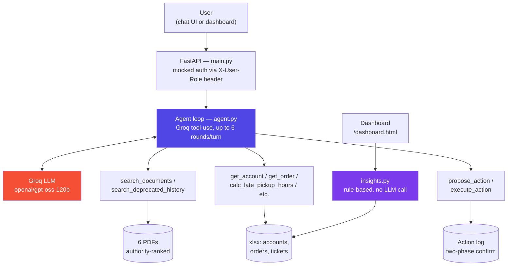

<div align="center">

# ParcelPilot AI Ops Assistant

**A tool-using LLM agent for logistics support & operations** — built for the CalQuity AI Engineer assessment

[](https://www.python.org/)
[](https://fastapi.tiangolo.com/)
[](https://groq.com/)
[](LICENSE)

**Live demo:** https://extraversive-intendedly-nathalie.ngrok-free.dev
**Test it yourself:** [`docs/test_prompts.md`](docs/test_prompts.md)

</div>

---

## The problem

ParcelPilot is a B2B logistics platform. Its 20-person support team
fields hundreds of weekly requests that require cross-referencing
signed customer contracts, general support policy, product
known-issues, and live order/ticket data — sources that don't always
agree. A customer-specific contract can override a standard policy. An
old policy document can still be sitting in the shared drive next to
the current one. Past ticket resolutions in the system are sometimes
just wrong. A naive chatbot bolted onto this data would confidently
give incorrect answers — which, for a support tool, is worse than not
having one at all.

## What I built

An internal ops agent that treats **source authority as structured
data, not a prompt suggestion**, and that **refuses to guess** when no
source covers a case. It reasons across contracts, policy, product
docs, and live data through a set of tools with access control and
conflict-resolution logic enforced in code — not left to the model's
discretion. A rule-based dashboard on top of the same data proactively
surfaces SLA risk and multi-customer issue patterns before a human has
to go looking for them.

## See it work — a real, verified exchange

This is unedited output from the live agent, reasoning across an order
lookup, an account lookup, and a document search in one turn.

> **Q: Can Northstar cancel ORD-1001 without a cancellation fee? Explain why.**
>
> 🔧 `get_order(order_id: "ORD-1001")`
> 🔧 `get_account(account_id: "ACCT-001")`
> 🔧 `search_documents(account_id: "ACCT-001", query: "cancellation fee")`
>
> **Yes — Northstar can cancel ORD-1001 with no cancellation fee.**
>
> | Source | Authority | What it says |
> |---|---|---|
> | Northstar Enterprise Agreement | Contract (highest) | *"Northstar may cancel any BOOKED shipment before pickup with NO cancellation fee, regardless of how long ago it was booked."* |
> | Cancellation & Service-Credit SOP v4 | Policy (lower) | Free cancellation only within 30 minutes; ₹250 fee after — unless a signed agreement waives it. |
>
> The contract is specific to this account and, per the authority
> hierarchy, overrides the general SOP. ORD-1001 is BOOKED and not yet
> picked up, which matches the contract's waiver condition — so the
> cancellation fee does not apply.

The agent chose the right three tools on its own, ranked a signed
contract above a general policy without being told which one wins for
*this specific question*, and gave a correct, explainable answer.
Seven more scenarios like this — including one that deliberately tests
whether it can be fooled by an outdated document — are in
[`docs/test_prompts.md`](docs/test_prompts.md); try them yourself
against the live demo.

## Engineering decisions and why I made them

Anyone can wire an LLM to some functions and call it an "agent." The
decisions below are what actually make this one trustworthy, and each
came with a real trade-off I chose deliberately rather than by default.

| Decision | Why | Trade-off accepted |
|---|---|---|
| **Authority ranking lives in the data layer**, not the prompt. Documents carry a rank (`contract` > `policy`/`sop` > `product_doc`); deprecated docs are excluded from retrieval entirely. | A prompt instruction ("prefer contracts") is a *suggestion* the model can drift from over a long conversation. A filtered, ranked list is a *guarantee* — the model literally cannot retrieve or cite what isn't returned. | More upfront tagging work per document; doesn't scale past a few dozen docs without moving to metadata-filtered vector search. |
| **Access control checks run inside the tool functions**, not just implied by the system prompt. | If a role check only exists as prompt text, a well-crafted injection can talk the model past it. A check inside `structured_data.py` has no such attack surface — the model can *ask* for anything, but the function decides what comes back. | More boilerplate in every tool function; a system prompt-only approach would have been faster to write. |
| **State-changing actions are structurally two-phase** (`propose_action` returns a token; `execute_action` requires it). | "Ask for confirmation" as an instruction can be skipped by the model under the right pressure. A token the model doesn't control and can't fabricate makes the skip *impossible*, not just discouraged. | An extra round-trip on every action; slightly more friction for the user, judged worth it for anything that writes data. |
| **Keyword search, not a vector index**, for the document tool. | The real pack is 6 one-page PDFs. An embedding pipeline adds latency and infra for zero retrieval-quality gain at this size. | Wouldn't scale past roughly a few dozen pages — noted explicitly rather than silently ignored; the retrieval function's interface doesn't change if swapped later. |
| **In-memory sessions**, no database. | Right-sized for a single-instance demo; a database is infrastructure the assessment doesn't need yet. | History resets on restart; not multi-instance safe. Documented, not hidden. |
| **Internal-only, not customer-facing.** | The brief allows either. Going deep on one context (plus the proactive-detection bonus) beats building both shallowly in the time available. | No customer-scoped chatbot in this submission — though the same tool layer supports one with account-scoped instead of role-scoped access. |

Full write-up of each, including what I'd change for production, is in
[`docs/architecture_note.md`](docs/architecture_note.md) and
[`docs/product_note.md`](docs/product_note.md).

## Tested against real failure modes, not just the happy path

- **Found and fixed a real bug during verification**: Groq's strict
  tool-schema validation rejected the model passing `null` for an
  optional parameter, which crashed a specific query type with a
  500 error. Caught by actually running the deprecated-policy test
  case, reproduced, fixed by widening the schema type, then
  re-verified against the live server. See the commit history for the
  full before/after.
- **Confirm-before-action was tested as two separate HTTP calls**, not
  assumed correct from reading the code: turn one proposes and
  returns a token without writing anything; turn two, only after an
  explicit "yes," executes. Verified via the actual API responses,
  not just visual inspection of the chat.
- **The deprecated-document trap was deliberately built to try to fool
  the agent** — asking it to apply the outdated v2 policy — and
  verified it correctly refuses and cites v3 instead. This and 7
  other adversarial-ish scenarios are documented, with expected
  behavior stated *before* running them, in
  [`docs/test_prompts.md`](docs/test_prompts.md).

## Architecture



`backend/insights.py` runs independently of the chat agent — a
deterministic, rule-based pass over the same underlying data — so the
proactive issue dashboard doesn't spend an LLM call on every page load.

## Capabilities checklist

| Assessment requirement | Where it lives |
|---|---|
| Natural-language chatbot | `frontend/index.html` + `backend/agent.py` |
| Document retrieval tool | `tools/document_search.py` |
| Structured-data / calculation tool | `tools/structured_data.py` |
| State-changing action tool | `tools/actions.py` |
| Confirm-before-action | Two-phase `propose_action` → `execute_action` |
| Multi-step, multi-source reasoning | Verified above: order → account → contract → SOP → answer |
| Access control | Role checks in the data layer, not just the prompt |
| Chat UI showing live tool use | Tool-call trace rendered inline, in real time |
| Bonus: proactive issue detection | `backend/insights.py` + `/dashboard.html` |

## Quick start

```bash
git clone https://github.com/MuhammadAbbas01/parcelpilot-ai-support.git
cd parcelpilot-ai-support
pip install -r requirements.txt
```

Get a free Groq API key at [console.groq.com](https://console.groq.com)
(no card required), then create `.env` in the project root:

```
GROQ_API_KEY=your_key_here
```

The synthetic data pack (`data_pack/`) is already included in this
repo, so no manual download step is needed.

```bash
cd backend
uvicorn main:app --reload --port 8000
```

- `http://localhost:8000` — the chatbot
- `http://localhost:8000/dashboard.html` — proactive issue dashboard
  (pick `ops_manager` or `admin` in the role dropdown)

To get a public link like the live demo above, run `ngrok http 8000`
in a second terminal (free ngrok account, no card).

## Hosting

The live demo link above is an **ngrok tunnel to the app running
locally**, not a persistent cloud deployment. That's a deliberate
trade-off, not an oversight: as of mid-2026, every major free-tier
host for a Docker/FastAPI backend has closed its doors — Hugging Face
Spaces now requires a PRO subscription for Docker, Render's free tier
asks new accounts for card verification despite its own marketing,
Koyeb closed free signups after its February 2026 acquisition by
Mistral AI, and Fly.io dropped its free tier back in 2024. Rather than
put a card on file for a hiring-assessment side project, the app runs
locally behind a free tunnel — genuinely live, genuinely free, with
the honest trade-off that it's only reachable while the tunnel process
is running. Full reasoning in [`docs/product_note.md`](docs/product_note.md).

## Project structure

| Path | Description |
|---|---|
| `backend/models.py` | Pydantic schemas — `Account`, `Order`, `Ticket`, `UserContext` |
| `backend/data_loader.py` | Loads real data from the xlsx at startup |
| `backend/agent.py` | Groq tool-use loop + system prompt (authority rules) |
| `backend/insights.py` | Proactive issue detection — SLA risk, ticket clusters, order anomalies |
| `backend/main.py` | FastAPI app, mocked auth, routes |
| `backend/tools/document_search.py` | Authority-ranked retrieval over the PDF pack |
| `backend/tools/structured_data.py` | Account/order/ticket lookups and calculations |
| `backend/tools/actions.py` | Two-phase state-changing action tool |
| `frontend/index.html`, `app.js` | Chat UI with live tool-call trace and markdown rendering |
| `frontend/dashboard.html`, `dashboard.js` | Proactive issue detection dashboard |
| `docs/` | Architecture note, product note, AI tool usage note, test prompts — see [Documentation](#documentation) below |
| `data_pack/` | Supplied synthetic assessment data |

## Documentation

| Doc | Covers |
|---|---|
| [`docs/architecture_note.md`](docs/architecture_note.md) | Agent design, tool design, source-conflict handling, trade-offs |
| [`docs/product_note.md`](docs/product_note.md) | Chosen bonus problem, what's next, what's out of scope, one metric |
| [`docs/ai_tool_usage.md`](docs/ai_tool_usage.md) | How AI coding tools were used in this build |
| [`docs/test_prompts.md`](docs/test_prompts.md) | 8 verified prompts covering every core capability |

---

<div align="center">

Built by **Muhammad Abbas** for the CalQuity AI Engineer assessment.

</div>
